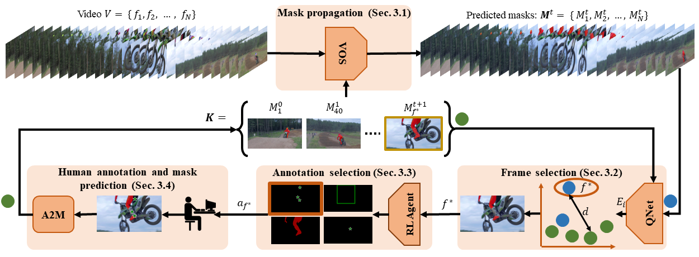

# Learning the What and How of Annotation in Video Object Segmentation
Created by [Thanos Delatolas](https://linkedin.com/in/thanos-delatolas), [Vikcy Kalogeiton](https://vicky.kalogeiton.info/), [Dim P. Papadopoulos](https://people.csail.mit.edu/dimpapa/)



[[`Paper (WACV 2024)`](https://arxiv.org/abs/2311.04414)] [[`Project page`](https://eva-vos.compute.dtu.dk)] [[`Extended Abstract (ICCV-W 2023)`](https://eva-vos.compute.dtu.dk/resources/eva_vos.pdf)]

## Installation
```bash
conda env create -f environment.yaml
```

## Data
Download the data with `python download_data.py`. The data should be arranged with the following layout: 
```bash
data
├── DAVIS_17
│   ├── Annotations
│   ├── ImageSets
│   └── JPEGImages
│           
├── MOSE
│   ├── Annotations
│   ├── ImageSets
│   └── JPEGImages
```
The script `download_data.py` also creates the train/val/test splits in MOSE, as discussed in the paper. If `qdown` denies access to the MOSE dataset, you can manually download MOSE from [here](https://drive.google.com/uc?id=10HYO-CJTaITalhzl_Zbz_Qpesh8F3gZR) and place it in the directory: `./data/MOSE/`

## Download weights
Download the model-weights with `python download_weights.py`. The weights should be arranged with the following layout: 
```bash
model_weights
├── mivos
│   └── stcn.pth
│   └── fusion.pth
├── qnet
│   └── qnet.pth
├── rl_agent
│   └── model.pth
├── sam
│   └── sam.pth
```
We provide the weights of [MiVOS](https://github.com/hkchengrex/MiVOS) trained only on YouTube-VOS. If you wish to replicate the training process, please refer to the original repository.

## Training 
* Generate Frame Quality Dataset: `python generate_fq_dataset.py --imset subset_train_4` and `python generate_fq_dataset.py --imset val`
* Train QNet: `python train_qnet.py`
* Generate the annotation type dataset: `python generate_annotation_dataset.py --imset subset_train_4`
* Train the RL Agent: `python train_rl_agent.py`

## Experiments
The script `eval_annotation_method.py` is used to execute all annotation methods. The script `scripts/eval.sh` can be used to run all the experiments. Finally, the scripts `vis/frame_selection.py` and `vis/full_pipeline.py` are used to plot the results obtained from the experiments conducted. To speed up the process, it is recommended to run the experiments simultaneously on multiple GPUs.

## Citation
```bibtex
@inproceedings{delatolas2024learning,
  title={Learning the What and How of Annotation in Video Object Segmentation},
  author={Thanos Delatolas and Vicky Kalogeiton and Dim P. Papadopoulos},
  year={2024},
  booktitle={Proceedings of the IEEE/CVF Winter Conference on Applications of Computer Vision (WACV)}
}
```
